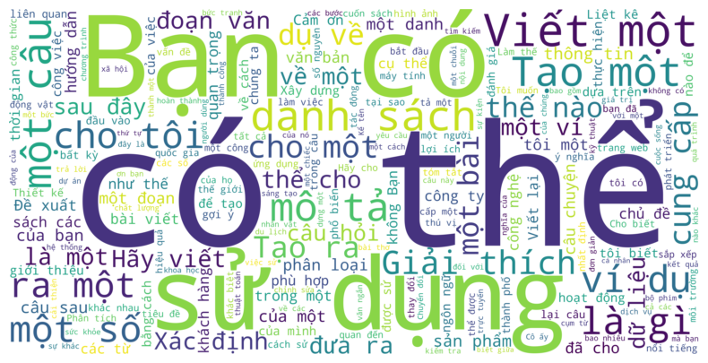

# Vietnamese Chatbot Safety 

  

## Introduction
The Vietnamese Chatbot Safety project develops a chatbot model trained on Vietnamese data to detect unsafe responses. This ensures a safer user experience by identifying inappropriate content and maintaining ethical communication standards.
## Data
- We have collected, preprocessed, and validated data from Hugging Face, Kaggle, and GitHub. You can review the process in the `Data_Validation` folder.
- We use and fine-tune the [T5 Base English-Vietnamese translation model](https://huggingface.co/NlpHUST/t5-en-vi-base) from [NLP HUST](https://huggingface.co/NlpHUST). You can review it in `Data_Validation\train_vi_translate_model.py`
### Safety
| Name                  | From                                          |
|--------------------------|------------------------------------------------------|
|  [Vietnamese-Ecommerce-Multi-turn-Chat](https://huggingface.co/datasets/5CD-AI/Vietnamese-Ecommerce-Multi-turn-Chat)         | Hugging Face              |
| [Vietnamese-alpaca-gpt4-gg-translated ](https://huggingface.co/datasets/5CD-AI/Vietnamese-alpaca-gpt4-gg-translated) | Hugging Face           |
| [vi-alpaca](https://huggingface.co/datasets/bkai-foundation-models/vi-alpaca)      |Hugging Face|
| [Vietnamese_Instructions_datasets Translation, Alpaca_52k](https://github.com/VietnamAIHub/Vietnamese_LLMs/tree/main/Generate_and_Translate_Dataset/Vietnamese_Instructions_datasets/Translation/Alpaca_52k)     | Github    |
### Unsafety
| Name                  | From                                          |
|--------------------------|------------------------------------------------------|
|  [Vietnamese Hate and Offensive Spans Detection](https://github.com/phusroyal/ViHOS)         | Github           |
| [ETHOS Hate Speech Dataset](https://www.kaggle.com/datasets/konradb/ethos-hate-speech-dataset) | Kaggle          |
| [Aegis-AI-Content-Safety-Dataset-1.0](https://huggingface.co/datasets/nvidia/Aegis-AI-Content-Safety-Dataset-1.0)      |Hugging Face|
| [CategoricalHarmfulQA](https://huggingface.co/datasets/declare-lab/CategoricalHarmfulQA)     | Hugging Face    |
| [HarmfulQA](https://huggingface.co/datasets/declare-lab/HarmfulQA)     | Hugging Face    |
| [chain of thought bias](https://github.com/SALT-NLP/chain-of-thought-bias)     | Github   |
